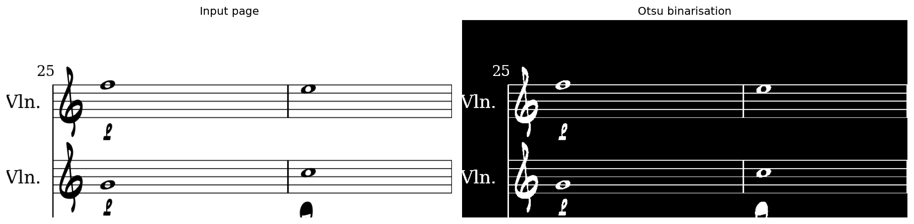
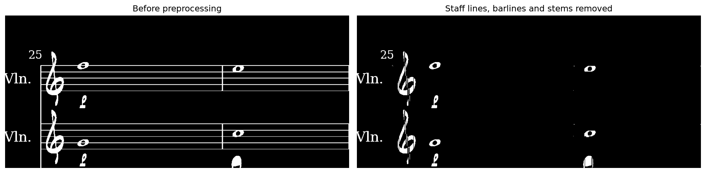
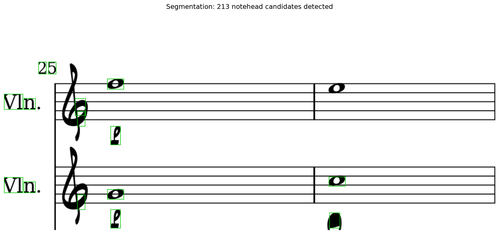
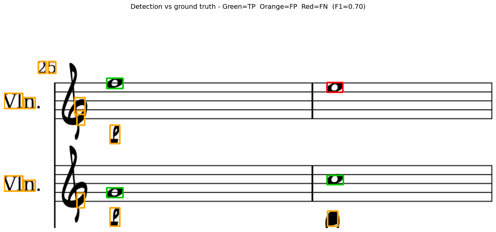
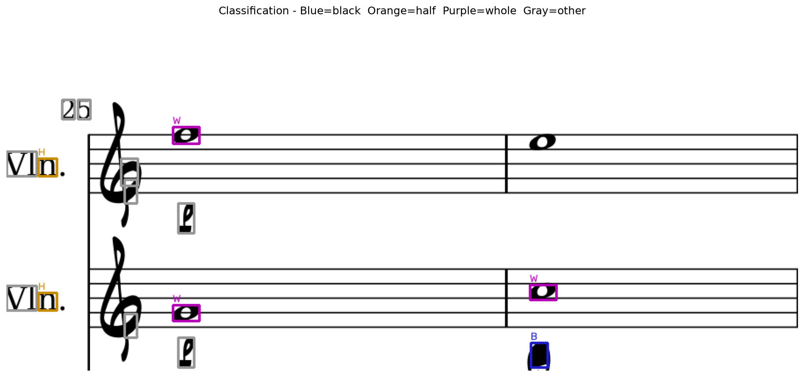
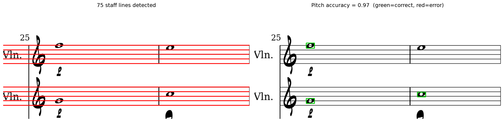

# partition_detector

Optical music recognition on scanned sheet music: find the noteheads on a page, classify them, and figure out which pitch they represent. Built as a school project for the Image major at EPITA.

There are two implementations in this repository. `python_implementation/` is where the pipeline was designed and validated on a notebook. `cpp_implementation/` is a from-scratch port of that same pipeline to C++/OpenCV, built to see how much of the Python prototype's runtime cost was algorithmic versus language overhead.

## Pipeline

Given a scanned page, the pipeline runs five steps: binarize the image, strip out the staff lines and stems, segment the remaining blobs into notehead candidates, classify each one, and map its vertical position on the staff to a pitch.

**1. Binarization.** We implemented Otsu's thresholding by hand (maximizing inter-class variance over the grayscale histogram) rather than calling `cv2.threshold`, then apply it with inverted polarity so ink pixels come out white.



**2. Preprocessing.** Staff lines are long, thin horizontal structures, so an opening with a wide horizontal kernel isolates and removes them. The same trick with a tall vertical kernel removes barlines, and a shorter one removes stems, leaving mostly notehead-shaped blobs.



**3. Segmentation.** Connected components on the cleaned image give candidate blobs, which we filter by aspect ratio and size relative to the average notehead dimensions in the ground truth.



Comparing detections against the DeepScoresV2 ground truth (a detection counts as correct if its center falls inside a ground truth box) gives us a first quality signal, independent of classification:



**4. Classification.** Each detected blob is classified with a from-scratch k-nearest-neighbors implementation (both a Python version validated against `sklearn.neighbors.KNeighborsClassifier`, and a C++ port), using 11 handcrafted features per symbol: 7 Hu moments, pixel density, aspect ratio, center density and a ring-shaped border density. Classification happens in two stages: first *notehead / rest / clef / other*, then, for noteheads only, *black / half / whole*.



**5. Pitch.** Staff lines are detected from the horizontal pixel projection, then grouped into staves. Each notehead's vertical center of mass is compared against the line/space positions of its nearest staff (including three ledger lines above and below) to get a relative pitch position.



## Results

Measured on DeepScoresV2 pages, against the targets we set at the start of the project:

| Step | Metric | Target | Result |
|---|---|---|---|
| Detection | F1 @ IoU >= 0.5 | > 0.50 | **0.628** |
| Classification (black/half/whole) | Accuracy | > 0.85 | **0.983** |
| Pitch | Accuracy | > 0.90 | **0.971** |

Detection is the weakest link and the per-class breakdown shows why: black noteheads are detected reliably (F1 0.840) but half and whole notes are harder to isolate from morphological filtering alone (0.389 and 0.655), since their open noteheads interact more with the staff-removal step. Classification and pitch estimation, which only run on symbols that were already segmented, comfortably clear their targets.

## Python vs C++

The two implementations share the same algorithms and were checked for numerical agreement (same Otsu threshold, same detections, same F1) on the same input. What differs is speed, and the gap is not what a naive "C++ is faster" intuition would predict:

| Step | Speedup (C++ / Python) |
|---|---|
| k-NN training | 208x |
| Otsu thresholding | 170x |
| k-NN prediction | 88x |
| **Dataset loading (JSON parsing)** | **0.1x (7x slower)** |
| **Overall pipeline** | **4.4x** |

The pixel-level and numerical routines are dramatically faster in C++, as expected once you replace NumPy's vectorized calls with tight loops over raw buffers. But parsing the DeepScoresV2 annotation file with `nlohmann::json` takes about 71 seconds, against roughly 8 seconds for Python's built-in `json` module, because loading the entire tree into `json` value nodes has a lot of allocation overhead compared to CPython's C-implemented parser. That single step is expensive enough to drag the overall speedup on a full run down from what the per-algorithm numbers would suggest to 4.4x. It is a useful reminder that "port to C++" is not a uniform win unless every hot path gets equal attention.

## Repository layout

```
partition_detector/
├── python_implementation/
│   ├── otsu.py                  Otsu thresholding
│   ├── neighbors.py             k-NN classifier
│   ├── classifier.py            feature extraction + two-level classifier
│   ├── partition_detector.ipynb full pipeline, run end to end on sample pages
│   └── tests/                   pytest suite (incl. a cross-check against sklearn)
│
└── cpp_implementation/
    ├── include/omr/             public headers
    ├── src/                     otsu, knn, features, classifier, preprocessing,
    │                            segmentation, staff, pitch, dataset, evaluation
    ├── src/main.cpp             CLI entry point running the full pipeline
    ├── tests/                   one executable per module, run through ctest
    └── third_parties/json.hpp   vendored nlohmann/json (single header)
```

## Dataset

We use [DeepScoresV2](https://zenodo.org/records/4012193) (dense split): about 1700 pages of synthetically rendered sheet music with dense bounding-box annotations across 135 symbol classes, plus a `rel_position` field per notehead that we use as pitch ground truth. No manual annotation was needed.

## Running it

### Python

The project was developed with [uv](https://docs.astral.sh/uv/):

```bash
cd python_implementation
uv sync
uv run pytest
```

Plain pip works too: `pip install matplotlib notebook numpy opencv-python pytest scikit-learn`.

Then open `partition_detector.ipynb`: the first code cell (commented out) downloads and extracts the dataset into `data/ds2_dense`, after which every cell runs top to bottom.

### C++

```bash
cd cpp_implementation
cmake -B build -DCMAKE_BUILD_TYPE=Release
cmake --build build
ctest --test-dir build
```

`omr_pipeline` needs OpenCV installed and discoverable by CMake (`libopencv-dev` on Debian/Ubuntu). To fetch the dataset and run on the default sample page:

```bash
./build/omr_pipeline --download --k 5
```

Other flags: `--data-dir`, `--sample`, `--train file1,file2,...`, `--dump-images <dir>` to write overlay PNGs for a visual check. Run `--help` for the full list.

## Authors

Gabin Clerbout and Elie Dalmas, EPITA Image major.
